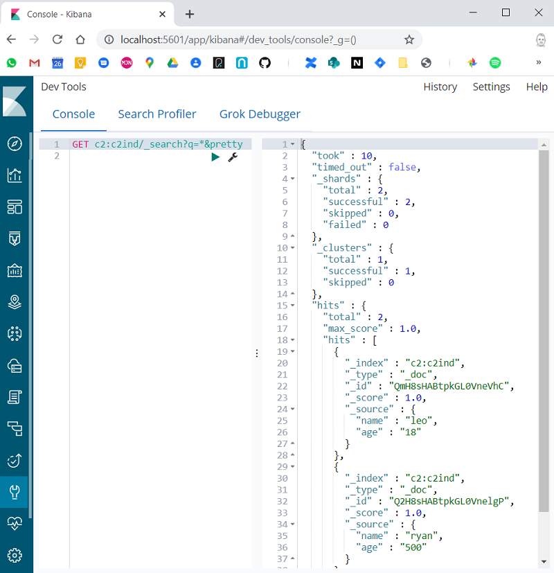

# Using Kibana With 2 Or More Elasticsearch Clusters
## Create 2 Elasticsearch Clusters and a Kibana Instance

Using docker containers, I created 2 ES clusters, each with 2 nodes - 4 containers in total.  I created a 5th container for Kibana.
```
> docker ps -a

CONTAINER ID IMAGE               COMMAND               PORTS                                          NAMES
0cd08909c412 elasticsearch:6.8.7 "/usr/local/bin/dock" 0.0.0.0:9200->9200/tcp, 0.0.0.0:9300->9300/tcp esc1n1
b30174d5bd04 elasticsearch:6.8.7 "/usr/local/bin/dock" 0.0.0.0:9201->9201/tcp, 0.0.0.0:9301->9301/tcp esc1n2
5fce5511c9b8 elasticsearch:6.8.7 "/usr/local/bin/dock" 0.0.0.0:9250->9250/tcp, 0.0.0.0:9350->9350/tcp esc2n1
e9384eda5c56 elasticsearch:6.8.7 "/usr/local/bin/dock" 0.0.0.0:9251->9251/tcp, 0.0.0.0:9351->9351/tcp esc2n2
2fb6e89d9dfb kibana:6.8.7        "/usr/local/bin/kiba" 0.0.0.0:5601->5601/tcp                         kibana
```
`esc1n1 = elasticsearch, cluster 1, node 1.`

See below for the Docker Compose script for creating these containers.

## Adding Some Data

I created an index in each cluster and added some accurate data.  (I have a utility script `es` - the operations are fairly clear).

### Cluster 1
```
> es createindex c1ind 2 0
(done)
> es addentry c1ind '{"name":"martin","age":"21"}'
(done)
> es addentry c1ind '{"name":"stelios","age":"51"}'
(done)
> es listindexes
health status index                pri rep docs.count docs.deleted store.size pri.store.size
green  open   .kibana_1              1   0          4            0     14.4kb         14.4kb
green  open   .kibana_task_manager   1   0          2            0     12.5kb         12.5kb
green  open   c1ind                  2   0          4            0       12kb           12kb
(3 lines)

```
### Cluster 2
```
> es createindex c2ind 2 0
(done)
> es addentry c2ind '{"name":"leo","age":"18"}'
(done)
> es addentry c2ind '{"name":"ryan","age":"500"}'
(done)
> es listindexes
health status index pri rep docs.count docs.deleted store.size pri.store.size
green  open   c2ind   2   0          2            0        8kb            8kb
(1 lines)
```

## Configure Cross Cluster Search

Next I configure cross cluster search.  Kibana connects to cluster 1 so I add cluster 2 as a remote cluster to cluster 1.

### Cluster 1

The remote cluster is given the label **c2**.
```
> es generic '_cluster/settings { "persistent":{"cluster":{"remote":{"c2":{ "seeds":["esc2n1:9350"]}}}}}'
(done)
```

## Run a Cross Cluster Search From Kibana

Next I switch to Kibana and run a cross cluster query.  To query an index on the remote cluster we prefix it with the cluster label `c2`.  To query the index `c2ind` I use `c2:c2ind`.  



## Docker Compose - Elasticsearch and Kibana Creation Script
```
version: '2.2'
services:
  esc1n1:
    image: docker.elastic.co/elasticsearch/elasticsearch:6.8.7
    container_name: esc1n1
    environment:
      - cluster.name=esc1
      - bootstrap.memory_lock=true
      - "ES_JAVA_OPTS=-Xms512m -Xmx512m"
      - http.port=9200
      - transport.tcp.port=9300
    ulimits:
      memlock:
        soft: -1
        hard: -1
    ports:
      - 9200:9200
      - 9300:9300
    networks:
      - esnet
  esc1n2:
    image: docker.elastic.co/elasticsearch/elasticsearch:6.8.7
    container_name: esc1n2
    environment:
      - cluster.name=esc1
      - bootstrap.memory_lock=true
      - "ES_JAVA_OPTS=-Xms512m -Xmx512m"
      - "discovery.zen.ping.unicast.hosts=esc1n1"
      - http.port=9201
      - transport.tcp.port=9301
    ulimits:
      memlock:
        soft: -1
        hard: -1
    ports:
      - 9201:9201
      - 9301:9301
    networks:
      - esnet

  esc2n1:
    image: docker.elastic.co/elasticsearch/elasticsearch:6.8.7
    container_name: esc2n1
    environment:
      - cluster.name=esc2
      - bootstrap.memory_lock=true
      - "ES_JAVA_OPTS=-Xms512m -Xmx512m"
      - http.port=9250
      - transport.tcp.port=9350
    ulimits:
      memlock:
        soft: -1
        hard: -1
    ports:
      - 9250:9250
      - 9350:9350
    networks:
      - esnet
  esc2n2:
    image: docker.elastic.co/elasticsearch/elasticsearch:6.8.7
    container_name: esc2n2
    environment:
      - cluster.name=esc2
      - bootstrap.memory_lock=true
      - "ES_JAVA_OPTS=-Xms512m -Xmx512m"
      - "discovery.zen.ping.unicast.hosts=esc2n1"
      - http.port=9251
      - transport.tcp.port=9351
    ulimits:
      memlock:
        soft: -1
        hard: -1
    ports:
      - 9251:9251
      - 9351:9351
    networks:
      - esnet

  kibana:
    image: docker.elastic.co/kibana/kibana:6.8.7
    container_name: kibana
    environment:
      - ELASTICSEARCH_URL=http://esc1n1:9200
    ports:
      - "5601:5601"
    networks:
      - esnet

networks:
  esnet:

```
<hr>
<p class="pagedate">This page was generated by <a href=".">GitHub Pages</a>.  Page last modified: 20/09/07 13:27</p>
