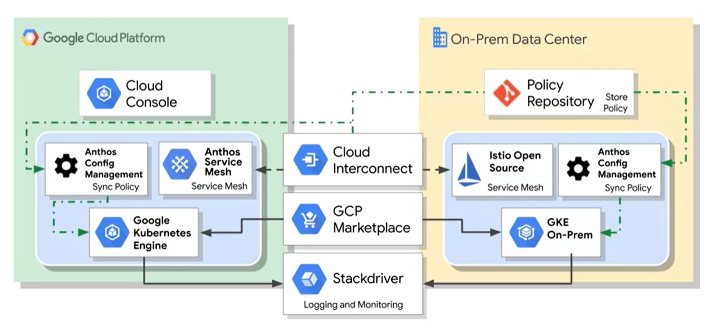

# Overview

**Containers** deliver a solution that sits somewhere between IaaS (GCE) and PaaS (App Engine).

GCE - VMs - An App runs on an OS running on a Hypervisor running on HW.

App Engine - An App runs on a service delivering Data, Cache, Storage, DBs, NW etc - very abstracted from the HW.

Containers - An App runs in a container which provides an OS delivered by the container engines which utilises the HW OS.

**Kubernetes** manages the execution of containers over a cluster of nodes (running on servers).

**Cloud Build** is a GCP container build tool.

# Docker

Docker File: (pg_server)

```
FROM ubuntu:18.10
RUN apt-get update -y &&\
    apt-get install -y python-pip python3-dev
COPY requirements.txt /app/requirements.txt
WORKDIR /app
RUN pip3 install -r requirements.txt
COPY . /app
ENTRYPOINT ["python3", "app.py"]
```

`> docker build -t pg_server .`

`> docker run -d pg_server`

# Kubernetes

`> gcloud container clusters create k1`

## Pods


A Pod has a unique IP address.

`> kubectl run nginx --image=nginx:1.15.7`

`> kubectl get pods`

`> kubectl expose deployment nginx --port=80 --type=LoadBalancer`


A service groups pods together with a single point of access (a fixed IP).

`> kubectl get services`

Scaling is easy.

`>kubectl scale nginx --replicas=3`

Auto scale when CPU hits 80%.

`kubectl autoscale nginx --min-10 --max=15 --cpu=80`

## Kubernetes adopts a Declarative Approach

Uses config files and not commands.

`kubectl apply -f nginx-deployment.yaml`

`kubectl get replica`

`kubectl get pod`

`kubectl get deployments`

`kubectl get services`

# Anthos

Hybrid / Multi Cloud

Kubernetes with GKE on prem`.

Both can read containers from the GCP Marketplace.




<hr>
<p class="pagedate">This page was generated by <a href=".">GitHub Pages</a>.  Page last modified: 22/12/04 17:45</p>
