This perhaps the oldest page on this website and its predecessors.  It is, as it says, a history of the cars I've owned.

# Best Car

## Audi S5 Quattro

**354bhp, 369lb-ft, 0-60mph: 4.7s, Top Speed: 155mph.**

A great car, very quick, accelerates hard in any gear.  The exhaust growls in sports mode.  The 8 speed auto gearbox changes very quickly - gear change let down my A5 V6 TDi Quattro, and this was the first thing I checked on the test drive.  Came with almost every extra including massaging heated front seats and Android Auto which means integrated Google Maps, Spotify etc.

I bought this at 2 years old but it was immaculate.  This is the best car I've had pushing my Audi S3 into second place.

**Previous Best Car:** Audi S3.

# First Car

## Austin Metro

**41bhp, 53lb-ft. 0-60mph: 18.2s. Top Speed: 86mph.**

This car looks boring now - it looked boring then but, it was reliable, cheap to run and fairly spacious. Heated rear window? No. Radio? No.

Once tried to drive through a flood. The water got so deep that I lost sight of the road and drove into the ditch. Water rushed in up to the height of the steering wheel. A perfect combination of plastic seats, nylon carpets and no electronics meant its dried out, and no one ever knew.

# Worst Car

## Ford Escort Encore 1.6

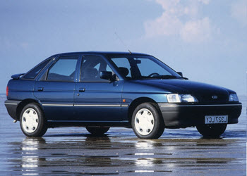

**89bhp. 96lb-ft. 0-60mph: 11.5s. Top Speed: 110mph.**

I had a VW Golf 1.3. I wanted something quicker. This was the young man's (easier to insure) Ford Escort XR3. Bought it from a garage and took out the garage car loan.

Within weeks I HATED this car, I hated the garage and I was trapped with a loan. Door and boot locks broke. Horn would come on for no good reason. Everything creaked. Awful car. Bought tears to my eyes.

# Quickest Car

## Audi S5 Quattro

**354bhp, 369lb-ft, 0-60mph: 4.7s, Top Speed: 155mph.**

A great car, very quick, accelerates hard in any gear.  The exhaust growls in sports mode.  The 8 speed auto gearbox changes very quickly - gear change let down my A5 V6 TDi Quattro, and this was the first thing I checked on the test drive.  Came with almost every extra including massaging heated front seats and Android Auto which means integrated Google Maps, Spotify etc..

I bought this at 2 years old but it was immaculate.  This is the best car I've had pushing my Audi S3 into second place.

**Previous Quickest Car:** Subari Impreza.

# Current Car

## Audi S5 Quattro

**354bhp, 369lb-ft, 0-60mph: 4.7s, Top Speed: 155mph.**

A great car, very quick, accelerates hard in any gear.  The exhaust growls in sports mode.  The 8 speed auto gearbox changes very quickly - gear change let down my A5 V6 TDi Quattro, and this was the first thing I checked on the test drive.  Came with almost every extra including massaging heated front seats and Android Auto which means integrated Google Maps, Spotify etc..

I bought this at 2 years old but it was immaculate.  This is the best car I've had pushing my Audi S3 into second place.

# The Lot - In Chronological Order

### 1. Austin Metro

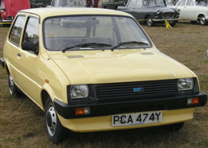

**41bhp. 53-ft. 0-60mph: 18.2s. Max: 86mph.**

The Colour was a little embarrassing for an 18yr old.

### 2. Mini 1100s

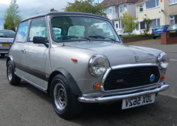

**46bhp. 56lb-ft. 0-60mph: 16.5s. Max: 98mph.**

Great fun but didn't like an up hill run.

### 3. Volkswagen Golf Mk2 1.3c

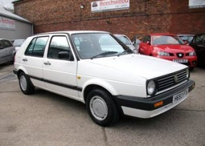

**54bhp. 71lb-ft. 0-60mph: 15.6s. Max: 94mph.**

Wish I'd kept this car longer. But - I wanted faster.

### 4. Ford Escort Encore 1.6

**89bhp. 96lb-ft. 0-60mph: 11.5s. Max: 110mph.**

A hideous car.

### 5. Volkswagen Golf Driver 1.8

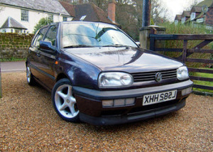

**90bhp, 107lb-ft. 0-60mph: 12.1s. Max: 111mph.**

The poor (young) man's Golf GTi.

### 6. Volkswagen Polo 1.0

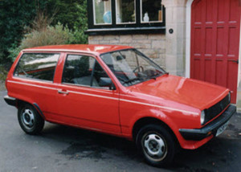

**44bhp. 55lb-ft. 0-60mph: 18.4s. Max: 88mph.**

Rock solid and surprisingly fun.

### 7. Rover 214 SLi

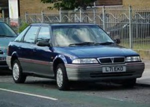

**95bhp. 94lb-ft. 0-60mph: 10.2s. Max: 115mph.**

Bought very cheap and traded in for a profit.

### 8. Peugeot 306 XSi

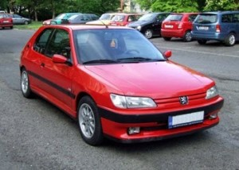

**135bhp. 133lb-ft. 0-60mph: 10.1s. Max: 125mph.**

My first proper 'Hot Hatch'.

### 9. Peugeot 306 GTi-6

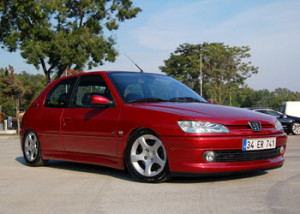

**167bhp. 142lb-ft. 0-60mph: 8.5s. Max: 135mph.**

Good performance, great handling. My first new car.

### 10. BMW Z3 2.8

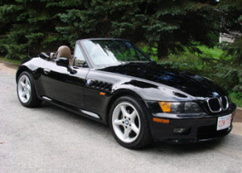

**193bhp. 206lb-ft. 0-60mph: 6.7s. Max: 140mph.**

The 2.8 model was NOT a hair dressers car.

### 11. Audi S3 Quattro

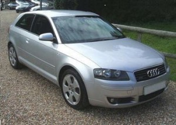

**225bhp. 206lb-ft. 0-60mph: 6.6s. Max: 151mph.**

A Great car with a great Bose sound system.

### 12. Toyota Land Cruiser 3.0 D4D

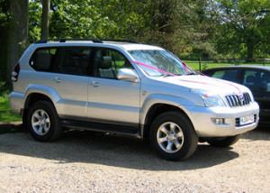

**164bhp. 410lb-ft. 0-60mph: 10.8s. Max: 109mph.**

Family Car - 7 seats of luxury, but with the Chelsea Wagon stigma.

### 13. Subari Impeza WRX Turbo

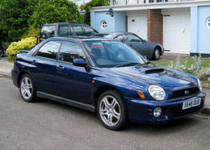

**221bhp. 221lb-ft. 0-60mph: 5.7s. Max: 144mph.**

Quick but difficult to drive in traffic.

### 14. Honda Civic Type-R

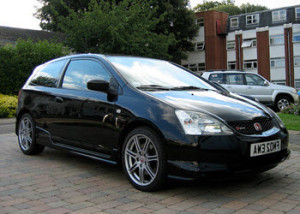

**197bhp, 145lb-ft. 0-60mph: 6.4s. Max: 146mph.**

Quick but difficult to drive in traffic.

### 15. Toyota Previa 2.4 VVTi T3

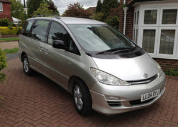

**154bhp. 166lb-ft. 0-60mph: 11s. Max: 112mph.**

Family Car - So practical and quite comfortable.

### 16. Audi A4 2.5V6 TDI

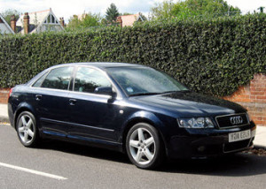

**155bhp. 229lb-ft. 0-60mph: 9.1s. Max: 137mph.**

I really liked the in gear acceleration.

### 17. Volkswagen Bora 2.3V5

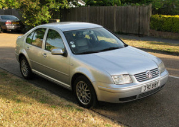

**170bhp. 162lb-ft. 0-60mph: 9.2s. Max: 137mph.**

Much cheaper than the V5 Golf. Auto gearbox a joke.

### 18. Audi A4 Conv 2.0TFSI S-Line

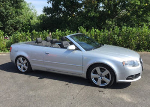

**197bhp. 207lb-ft. 0-60mph: 7.8s. Max: 144mph.**

Interesting Multitronic (continuously variable) gearbox.

## 19. Golf 2.0TDi

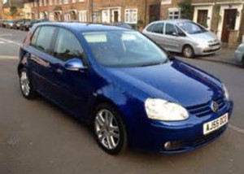

**138bhp. 236lb-ft. 0-60mph: 9.3s. Max: 126mph.**

Family Car - Bigger inside than it looks.

### 20. LandRover Discovery 3 2.7 V6 HSE

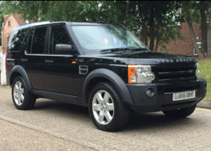

**190bhp. 324lb-ft. 0-60mph: 11s. Max: 112mph.**

A Great sound system but lots of niggly faults.

### 21. Mercedes A Class 250 AMG Sport 7G-Tronic

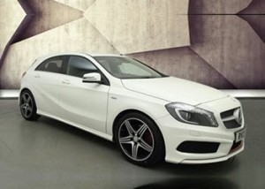

**208bhp. 258lb-ft. 0-60mph: 6.3s. Max: 149mph.**

Rock hard AMG suspension but fun to drive in sports mode.

### 22. Audi A5 TDI v6 Quattro

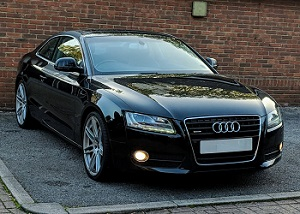

**242bhp. 368lb-ft. 0-60mph: 5.8s. Max: 155mph.**

A great car, quick but reasonably economic.  Only complaint - auto gear change a little slow.

### 23. Audi Q7 3.0TDI Quattro

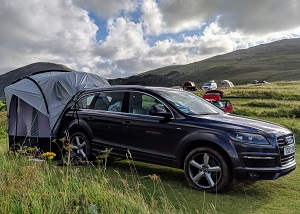

**228bhp. 369lb-ft. 0-60mph: 8.4s. Max: 137mph.**

Bought this car for the 7 seats and soon after most the children were too old to want to go anywhere with us.  Was 10 years old when I bought it, but it was like new inside.  Great car, but to big to use every day.

### 24. Audi S5 Quattro

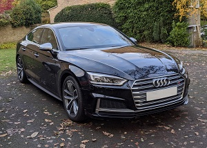

**354bhp, 369lb-ft, 0-60mph: 4.7s, Top Speed: 155mph.**

A great car, very quick, accelerates hard in any gear.  The exhaust growls in sports mode.  This is the best car I've had pushing my Audi S3 into second place.

This page was generated by <a href=".">GitHub Pages</a>.  Page last modified: 20/10/27 19:33

