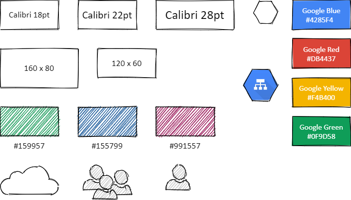

# Heading 1
`# Heading 1`
## Heading 2
`## Heading 2`
### Heading 3
#### Heading 4
##### Heading 5
###### Heading 6

---
Horizontal Line: `---`


**Bold**: `**Bold**`

*Italic*: `*Italic*`

***Bold Italic***: `***Bold Italic***`

[GitHub](http://github.com): `[GitHub](http://github.com)`

> Block Quote: `> Block Quote`

# Simple Lists

Single spacing:

-  Simple list
-  Simple list
-  Simple list

Markdown:
```
-  Simple list
-  Simple list
-  Simple list
```

Double spacing:

-  Simple list

-  Simple list

-  Simple list

Markdown:
```
-  Simple list

-  Simple list

-  Simple list
```

Multiple indents:

-  Simple list
   -  Simple list
      -  Simple list
      -  Simple list
   -  Simple list
      -  Simple list
-  Simple list

Markdown:
```
-  Simple list
   -  Simple list
      -  Simple list
      -  Simple list
   -  Simple list
      -  Simple list
-  Simple list
```

# Numbered Lists

Single spacing:

1. Numbered list
1. Numbered list
1. Numbered list

Markdown:
```
1. Numbered list
1. Numbered list
1. Numbered list
```

Double spacing:

1. Numbered list

1. Numbered list

1. Numbered list

Markdown:
```
1. Numbered list

1. Numbered list

1. Numbered list
```

1. Numbered list

   1. Numbered list

      1. Numbered list

      1. Numbered list

   1. Numbered list

Markdown:
```
1. Numbered list

   1. Numbered list

      1. Numbered list

      1. Numbered list

   1. Numbered list
```

# Tables

Heading 1 | Heading 2
---|---
Column 1 | Column 2
Column 1 | Column 2

Markdown:
```
Heading 1 | Heading 2
---|---
Column 1 | Column 2
Column 1 | Column 2
```

# Images


Markdown:
```


Alternatively:


To put the image in a table cell:

|  |
```

# Draw IO Template



# Code Blocks

```javascript
function fancyAlert(arg) {
  if(arg) {
    $.facebox({div:'#foo'})
  }
}
```

Markdown:
```
    ```javascript
    function fancyAlert(arg) {
       if(arg) {
          $.facebox({div:'#foo'})
       }
    }
    ```
```

Here a list of common languages that can be used with the backtick (see full list in [Linguist - languages.yml](https://github.com/github/linguist/blob/master/lib/linguist/languages.yml) ).


- actionscript3
- apache
- applescript
- asp
- brainfuck
- c
- cfm
- clojure
- cmake
- coffee-script, coffeescript, coffee
- cpp - C++
- cs
- csharp
- css
- csv
- bash
- diff
- elixir
- erb - HTML + Embedded Ruby
- go
- haml
- http
- java
- javascript
- json
- jsx
- less
- lolcode
- make - Makefile
- markdown
- matlab
- nginx
- objectivec
- pascal
- PHP
- Perl
- python
- profile - python profiler output
- rust
- salt, saltstate - Salt
- scala
- shell, sh, zsh, bash - Shell scripting
- sql
- scss
- sql
- svg
- swift
- rb, jruby, ruby - Ruby
- smalltalk
- vim, viml - Vim Script
- volt
- vhdl
- vue
- xml - XML and also used for HTML with inline CSS and Javascript
- yaml

<hr>
<p class="pagedate">This page was generated by <a href=".">GitHub Pages</a>.  Page last modified: 22/12/11 19:21</p>
