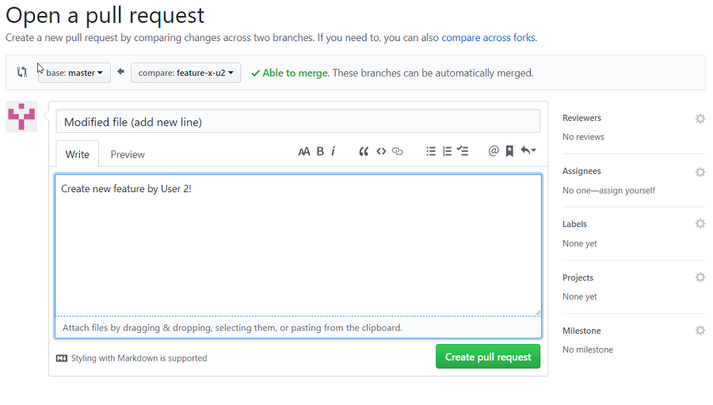
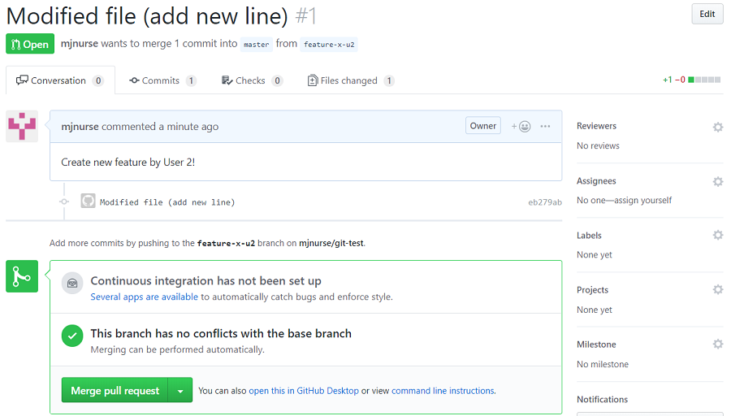
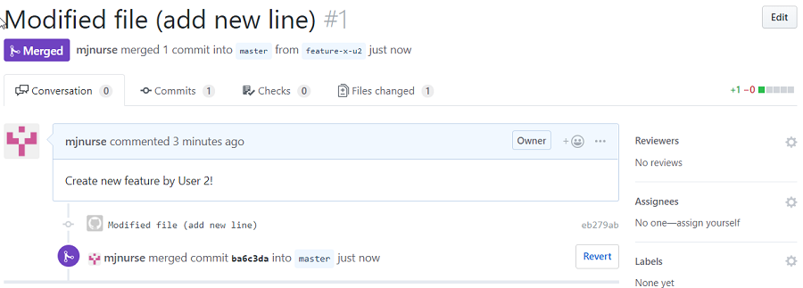

In the following walk-through we use Git and GitHub from the view point of two 'users' in parallel and look at the workflow and interaction between the two.

----

## Simulate two users - each has a home directory 

Create two 'user home' directories:

```
> ~/git-test$ mkdir user1
> ~/git-test$ mkdir user2
```

----

## Use User1 to create a file, add this to Git and push the local Git repo up and into GitHub

Go to User1 home directory and initialise local Git:

```
> ~/git-test$ cd user1
> ~/git-test/user1$ git init
Initialized empty Git repository in /home/martin/git-test/user1/.git/
```

Create a text file add add this is local Git:

```
> ~/git-test/user1$ echo "hello - I am the first version of the file" > file
> ~/git-test/user2$ cat file
hello - I am the first version of the file
> ~/git-test/user1$ git add file 
```

Set username and email in local Git:

If we don't do this, Git will prompt for this information for a commit.

```
> ~/git-test/user1$ git config --local user.name "User 1"
> ~/git-test/user1$ git config --local user.email "user1@test.com"
```

Ask Git to store the credentials locally:

```
> ~/git-test$ git config credential.helper store
```

Commit this (new file) change to local Git:

```
> ~/git-test/user1$ git commit -m "Created the file"
[master (root-commit) aaa4a05] Created the file
 Committer: Martin <martin@server>
 1 file changed, 1 insertion(+)
 create mode 100644 file
```

Push this local Git repo up and into GitHub:  

First add (create connection to) remote git - call it origin.

```
> ~/git-test/user1$ git remote add origin https://github.com/mjnurse/git-test.git
```

Second push to origin the current branch - master.

```
> ~/git-test/user1$ git push origin master
Username for 'https://github.com': mjnurse
Password for 'https://mjnurse@github.com': 
Counting objects: 3, done.
Writing objects: 100% (3/3), 276 bytes | 0 bytes/s, done.
Total 3 (delta 0), reused 0 (delta 0)
To https://github.com/mjnurse/git-test.git
 * [new branch]      master -> master
```

----

**INFO** We now have a repository in GitHub called git-test and this is in sync with the local Got repo for User 1.

----

## Use User 2 to develop a new feature in the code stored in GitHub

### First we create a local Git repo for User 2 - We clone the repo in GitHub

Switch to User 2 directory, clone the GitHub repo to a local instance of Git:

```
> ~/git-test/user2$ git clone https://github.com/mjnurse/git-test.git .
```

Again set username and email in local Git:

```
> ~/git-test/user2$ git config --local user.name "User 2"
> ~/git-test/user2$ git config --local user.email "user2@test.com"
```

### Now User 2 develops a new feature in the code

Create a development branch for User 2 to create a feature (call it x):

```
> ~/git-test/user2$ git branch feature-x-u2
```

Switch to (checkout) the development branch code to current directory:

```
> ~/git-test/user2$ git checkout feature-x-u2
Switched to branch 'feature-x-u2'
```

Confirm we are now working on the branch feature-x-u2:

```
> ~/git-test/user2$ git branch
* feature-x-u2
  master
```

Make a change to file, add this to local Git and Commit:

```
> ~/git-test/user2$ echo "This is a second line added by User2 (on branch feature-x-u2)." >> file
> ~/git-test/user2$ cat file
hello - I am the first version of the file
This is a second line added by User2 (on branch feature-x-u2).
> ~/git-test/user2$ git add file
> ~/git-test/user2$ git commit -m "Modified file (add new line)"
[feature-x-u2 eb279ab] Modified file (add new line)
 1 file changed, 1 insertion(+)
```

### Now User 2 wants to have the changes merged up and into the master branch in GitHub

This is a three stage process to ensure, as best we can, we don't break (invalidate) the current code in master.

#### Stage 1:

We merge the most recent version of master in GitHub into the current development branch.  This means that we are responsible for ensuring our branch changes plus master is valid.

#### Stage 2:

We push the latest version of branch in local Git up and into GitHub.

#### Stage 3:

We request / preform a GitHub 'pull request' to have he branch merged into the current master branch.

Note: Master could of changed again but the risk here is small - however we could check by pulling the master branch again from GitHub

Switch back to the master branch in local Git and run a pull from GitHub to make sure this is up to date:

```
> ~/git-test/user2$ git checkout master
Switched to branch 'master'
Your branch is up-to-date with 'origin/master'.
> ~/git-test/user2$ git pull origin master
From https://github.com/mjnurse/git-test
 * branch            master     -> FETCH_HEAD
Already up-to-date.
```

Switch back to the dev branch and merge the master branch into the dev branch:

```
> ~/git-test/user2$ git checkout feature-x-u2
Switched to branch 'feature-x-u2'
> ~/git-test/user2$ git merge master
Already up-to-date.
```

Not changes were made or conflicts identified.

Push the dev branch up and into GitHub:

Note: As this branch does not already exist in GitHub we need to instruct Git to create the branch.

```
> ~/git-test/user2$ git push --set-upstream origin feature-x-u2
Username for 'https://github.com': mjnurse
Password for 'https://mjnurse@github.com': 
Counting objects: 3, done.
Compressing objects: 100% (2/2), done.
Writing objects: 100% (3/3), 335 bytes | 0 bytes/s, done.
Total 3 (delta 0), reused 0 (delta 0)
remote: 
remote: Create a pull request for 'feature-x-u2' on GitHub by visiting:
remote:      https://github.com/mjnurse/git-test/pull/new/feature-x-u2
remote: 
To https://github.com/mjnurse/git-test.git
 * [new branch]      feature-x-u2 -> feature-x-u2
Branch feature-x-u2 set up to track remote branch feature-x-u2 from origin.
```

### Execute a Pull Request to merge dev branch to master in GitHub

Open GitHub in a browser and navigate to the repository in use.


Click on 'Compare & pull request' to request the merge into master.



Add a comment and click on 'Create pull request'.



Click on 'Merge pull request' and then click on 'Confirm merge'.



The merge is complete.

Note: It is common (best) practice to limit the number of users who are able to merge changes into the master branch but I've skipped that here for simplicity.

----

**INFO** We now have a repository in GitHub which includes the feature-x-u2 development branch and the feature-x-u2 branch has been merged into the master branch.

----

## Back to User 1 - Assume User 1 is also adding a new feature and started work before User 2 had merged their change:

### Now User 1 develops a new feature in the code

Create and switch to (checkout) development branch for User 1 to create a feature (call it y):

```
> ~/git-test/user2$ git checkout -b feature-x-u2
Switched to a new branch 'feature-y-u1'
```

Make a change to file, add this to local Git and Commit:

```
> ~/git-test/user1$ echo "This is a second line added by User1 (on branch feature-y-u2)." >> file
> ~/git-test/user1$ cat file 
hello - I am the first version of the file
This is a second line added by User1 (on branch feature-y-u2).
> ~/git-test/user1$ git add file 
> ~/git-test/user1$ git commit -m "Modified file (added a new line)"
[feature-y-u1 606700e] Modified file (added a new line)
 1 file changed, 1 insertion(+)
```

----

As above, to prepare for a merge into master, get most recent version of master from GitHub and merge it into this branch:

Switch back to the master branch in local Git and run a pull from GitHub to make sure this is up to date:

```
> ~/git-test/user1$ git checkout master
Switched to branch 'master'
> ~/git-test/user1$ git pull origin master
remote: Enumerating objects: 6, done.
remote: Counting objects: 100% (6/6), done.
remote: Compressing objects: 100% (3/3), done.
remote: Total 4 (delta 0), reused 3 (delta 0), pack-reused 0
Unpacking objects: 100% (4/4), done.
From https://github.com/mjnurse/git-test
 * branch            master     -> FETCH_HEAD
   aaa4a05..ba6c3da  master     -> origin/master
Updating aaa4a05..ba6c3da
Fast-forward
 file | 1 +
 1 file changed, 1 insertion(+)
```

Check file in the local Git master branch and notice it is the version merged into GitHub by User 2:

```
> ~/git-test/user1$ cat file
hello - I am the first version of the file
This is a second line added by User2 (on branch feature-x-u2).
```

Switch back to the dev branch and merge the master branch into the dev branch:

```
> ~/git-test/user1$ git checkout feature-y-u1
Switched to branch 'feature-y-u1'
> ~/git-test/user1$ git merge master
Auto-merging file
CONFLICT (content): Merge conflict in file
Automatic merge failed; fix conflicts and then commit the result.
```

The merge failed as Git was unable to determine which line 2 is correct.

Inspect the conflict and the manually fix the conflict.  In this case rename one of the lines:

```
> ~/git-test/user1$ cat file
hello - I am the first version of the file
<<<<<<< HEAD
This is a second line added by User1 (on branch feature-y-u2).
=======
This is a second line added by User2 (on branch feature-x-u2).
>>>>>>> master
> ~/git-test/user1$ vi file
> ~/git-test/user1$ cat file
hello - I am the first version of the file
This is a second line added by User1 (on branch feature-y-u2).
This is a third line added by User2 (on branch feature-x-u2).
```

Add and commit the new version of file to the dev branch in the local Git:

```
> ~/git-test/user1$ git add file
> ~/git-test/user1$ git commit -m "Merged master into feature y"
[feature-y-u1 238442a] Merged master into feature y
```

----

**INFO** We now have a dev branch within which all conflicts for a merge into GitHub master have been addressed.

----

## Push this local Git dev branch up into GitHub

```
> ~/git-test/user1$ git push --set-upstream origin feature-y-u1
Username for 'https://github.com': mjnurse
Password for 'https://mjnurse@github.com': 
Counting objects: 6, done.
Compressing objects: 100% (4/4), done.
Writing objects: 100% (6/6), 597 bytes | 0 bytes/s, done.
Total 6 (delta 1), reused 0 (delta 0)
remote: Resolving deltas: 100% (1/1), done.
remote: This repository moved.  Please use the new location:
remote:   https://github.com/mjnurse/git-test.git
remote: 
remote: Create a pull request for 'feature-y-u1' on GitHub by visiting:
remote:      https://github.com/mjnurse/git-test/pull/new/feature-y-u1
remote: 
To https://github.com/mjnurse/git-test.git
 * [new branch]      feature-y-u1 -> feature-y-u1
Branch feature-y-u1 set up to track remote branch feature-y-u1 from origin.
```

This branch in GitHub can now be merged into the GitHub master branch using the same process as described above.  Assuming this master branch has not changed since User 1 last pulled from GitHub the merge will not have any conflicts.

If there are conflicts, User 1 can be asked to pull the master branch again and repeat the merge.

<hr>
<p class="pagedate">This page was generated by <a href=".">GitHub Pages</a>.  Page last modified: 20/11/30 18:32</p>
